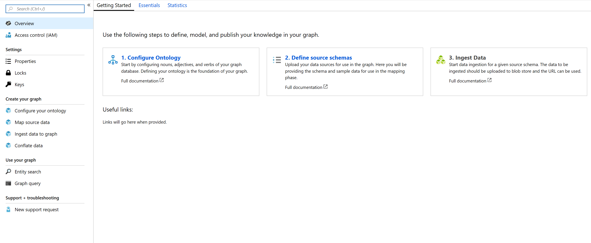
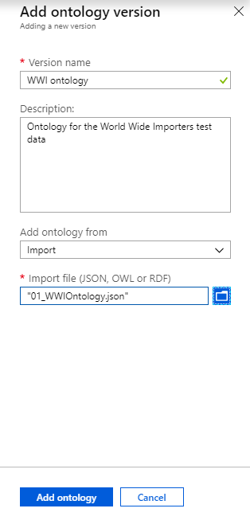
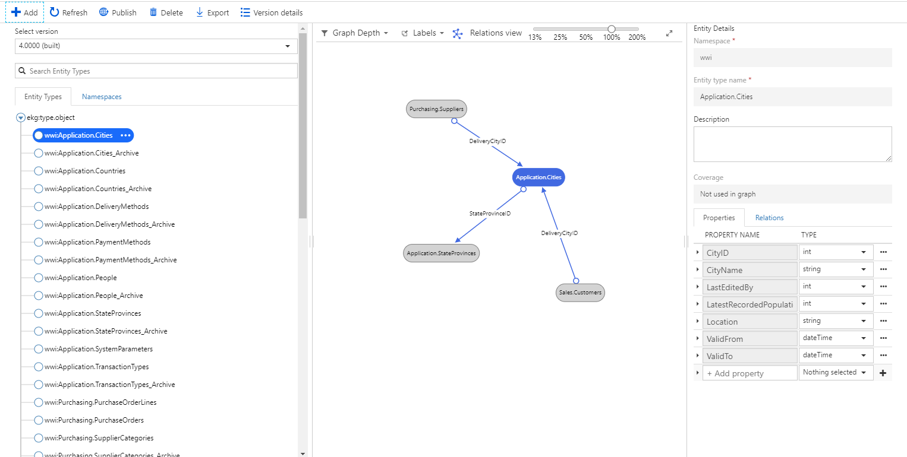
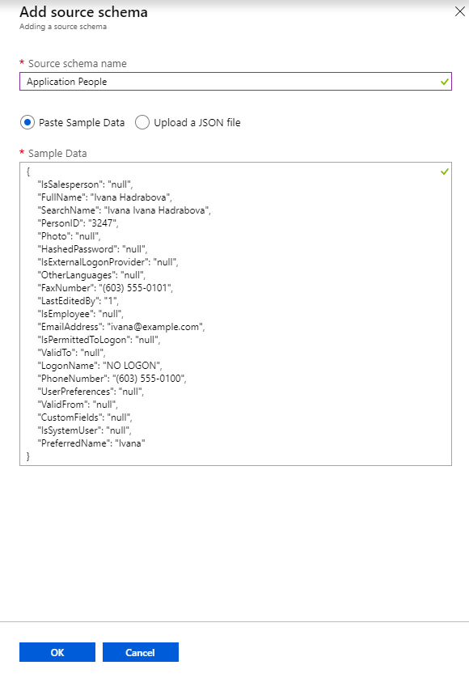
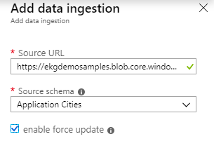

# Building your first graph

To get started with the Enterprise graph, we've provided everything you need to complete the graph-build process end to end.

You can download the sample files we use for this quick-start here <a href="https://ekgdemosamples.blob.core.windows.net/ekgdemosamples01/EGDemo_WWI_Files.zip">here</a>.

## (1) Creating an ontology

Your ontology is the like the 'dictionary' of your graph, containing the definitions of the entities you want to use and what properties they have. The ontology defines the entity types, and then later we'll import data to create actual entities. So for example, in this step we'll define a 'City' entity that has a 'CityName' property, and later on we'll create actual city entites, e.g. Kniman, Cubero and so on.

To get started, choose **Configure Ontology** from the Overview page, or choose the **Configure your ontology** option from the menu blade.

 

Click on the **+Add** button, and you'll see the **Add ontology version** pane.

In this pane, you can see there are options to create an ontology from scratch, modify one of the Microsoft-supplied ontologies, or import an existing ontology. For now, we're going to import a pre-created ontology, based on the <a href="http:///www.microsoft.com">World Wide Importers sample data</a>.

In the ontology pane, choose a suitable name (like 'WWI ontology'), add a description if you want, choose the 'Import' option from the 'Add ontology from' dropdown, and then choose the '01_WWIOntology.json' file from the sample files.

Once the ontology is created, you can examine the different entity types and the attributes they have through the browser. In this screenshot for example we can see the **Application.Cities** entity type. We can also see that two other entities link to the **Cities** entities - **Purchasing.Suppliers** and **Sales.Customers**. We can also see that **Application.Cities** itself links to the entity **Application.StateProvinces** with a link type of 'StateProvinceID' showing the province the city is located in.

To complete this step, choose **Publish** to put your ontology live. 

## (2) Creating and mapping source schema

Now that we have our ontology in place, we can move to the next step: relating the ontology to your source data. Your 'source data' is the data you intend to upload to your graph.

First, we want tell the system what fields your source data contains. Your source data must be formatted as a TSV, as we'll see later, and in this step 'Sample data' means a sample of the data you ultimately intend to upload.

In the sample data we've provided, there are five source schemas:

02_Schema_Application.Cities.json
03_Schema_Application.Countries.json
04_Schema_Application.StateProvinces.json
05_Schema_Application.People.json
06_Schema_Sales.Customers.json

In each case, what the source schema is saying is: These are the headings of the data I intend to upload. So for example, the 02_Schema_Application.Cities.json file looks like this:

{"LastEditedBy": "1", "ValidTo": "null", "CityName": "Kniman", "CityID": "17940", "Location": "null", "ValidFrom": "null", "LatestRecordedPopulation": "null", "StateProvinceID": "15"}

What we're interested in right now are the column headings - 'ValidTo', 'CityName', 'CityID' and so on. We want to get these headings into the system so we can map them to our ontology in the next step. To do that:

(1) Click on **+Add** to upload a source schema file
(2) Choose an appropriate name, e.g. 'Application-People'
(3) Choose the 'Upload a JSON file' option
(4) Choose the 02_Schema_Application.Cities.json file to upload

You'll see the file previewed in 'Sample Data' window, and you can click OK.

Next, we need to map those source schemas to our ontology. You'll see that the last column says 'No fields mapped' - in other words, we have defined our ontology and we've defined what our source data looks like, but we have not defined the links between them. Let's do that now.

Click on **No fields mapped** for Cities, and then choose wwi.ApplicationCities as the **Target Entity Type**.

On the left you're seeing your ontology (specifically, the entity for cities) and on the right you're seeing the schema map of your own data.

To show that the 'CityName' data should map to the ApplicationCities.CityName property, you just select CityName on the right (i.e. in the map of your data) and then select ApplicationCities.CityName (i.e in the ontology).

Mapping has a few more complexities around choosing a **Subject key** and setting **Rules** which allow you to define what happens if the data meets or does not meet certain criteria (e.g. if the date of birth for a person is not present, you may not want to create an entity for that person until the data issue is resolved). For simplicity, we're going to skip over those for now - for more detail, see the 'Tutorials' section in the sidebar.

To complete this step, we have provided XML mapping files which contain the mapping data to relate the source schemas to the ontology. Go ahead and upload those now for each of the provided files. In each case, choose the entity from the dropdown and the matching mapping file:

wwi: Application.Cities -> 07_Mapping_Application.Cities.xml
wwi: Application.Countries -> 08_Mapping_Application.Countries.xml
wwi: Application.StateProvinces -> 09_Mapping_Application.StateProvinces.xml
wwi: Application.People -> 10_Mapping_Application.People.xml
wwi: Sales.Customers -> 11_Mapping_Sales.Customer

## (3) Data ingestion

The hard work of creating the ontology and mapping your source data is now done, and it's time to import your input data.

The data comes from the TSV data sources. The easiest way to handle the import is to use Azure Blob Storage, and that is where we have put the sample data for you import. To complete the import step, use the following URLs with their matching source schemas, as in the screenshot:

https://ekgdemosamples.blob.core.windows.net/ekgdemosamples01/12.1_Ingestion_Application.Cities.tsv
https://ekgdemosamples.blob.core.windows.net/ekgdemosamples01/12.2_Ingestion_Application.Countries.tsv
https://ekgdemosamples.blob.core.windows.net/ekgdemosamples01/12.3_Ingestion_Application.StateProvinces.tsv
https://ekgdemosamples.blob.core.windows.net/ekgdemosamples01/12.4_Ingestion_Application.People.tsv
https://ekgdemosamples.blob.core.windows.net/ekgdemosamples01/12.5_Ingestion_Sales.Customers.tsv

Once you've done this for each file, congratulations! You have built your first graph on the Enterprise Graph platform.
