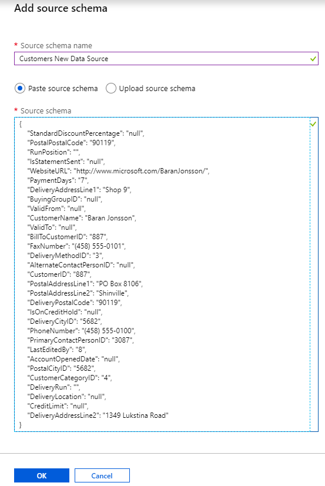
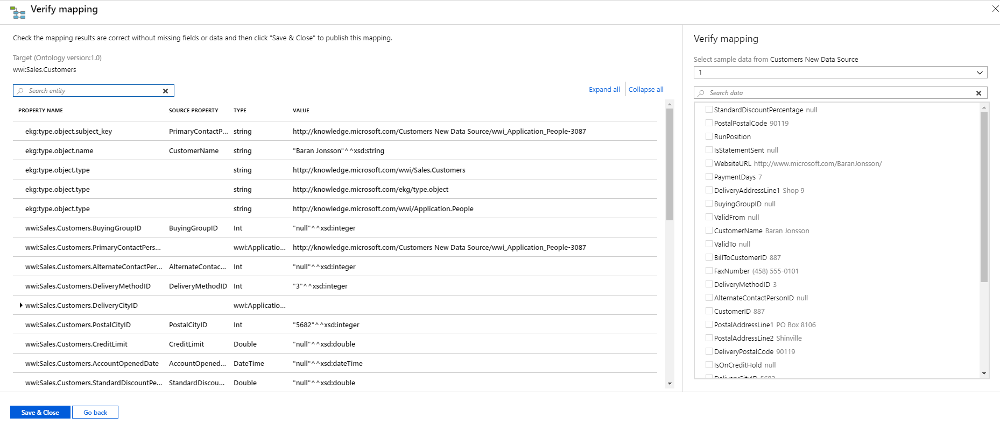
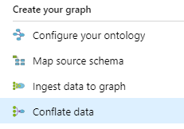
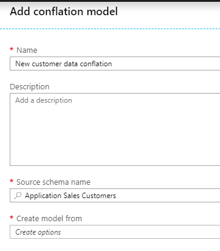
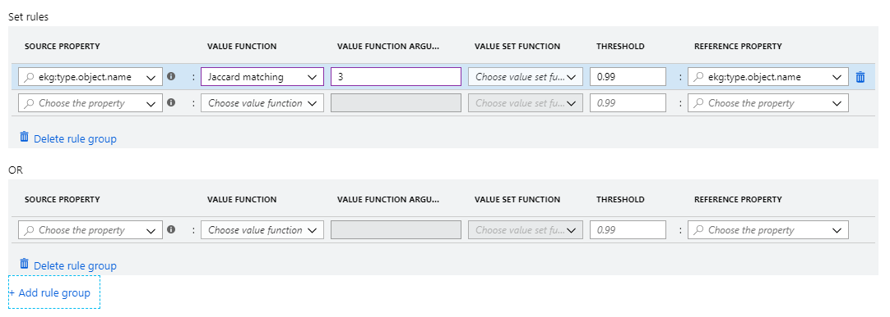
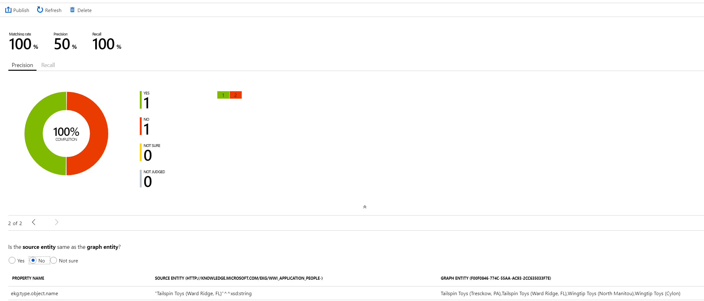

# Conflation

In this example we will create a conflation model to apply to the Customer entity type.

As dicussed, conflation is the process of merging entities which refer to the same thing. To illustrate, we are going to input some new data about ```Customer``` entities, and create a model to merge the new information with the existing graph information.

## (1) Ingest the new data

Our first step is to ingest the new data so that it exists in the Enterprise Graph platform.

To do that, we can use the same source schema that we used previously in the quickstart example. In other words, the columns of data in the new source are the same as we were mapped in the original source schema, but the actual data is different. We add the new source in the **Ingest data to graph** section, as we did in the quickstart.



As before, this data needs to be mapped to the ontology. Again, we can use the same schema map as before for this new ingestion, because the fields map the same way to the ontology - it's the actual data which has changed, not the column headers.

First we see the new source as not mapped:


Then once we upload the mapping as in the quickstart, we see:



Now we can see we have two customer data sources:


We're now ready to create the conflation model.

## (2) Create conflation model

Navigate to the **Conflate Data** section of the interface:



Choose **+Add** at the top left, and you'll see the new creation model window:



Choose a name and optionally add a description, and select the source schema you want to conflate.

As soon as you choose 'New' from the 'Create model from...' option (as opposed to upload an existing conflation model), you will see additional options:


This is where we set the matching rules for how the new data and the old data should be combined, i.e. what rules need to be satisfied before an entity will be merged.

On the left, the **Source property** information refers to the new data you want to add to your graph. On the right, the **Reference property** refers to the existing graph information. IN the middle, you set the matching rules, which we will discuss in more detail in the conflation rules article.

For this example, we will conflate the data based on the customer name, with some fuzzy matching to allow for spelling variations and so on. The configuration looks like:


What we're saying here is:
* For the entity type ```wwwi:Sales.Customers```...
* ...if the name of the entity created from the source data...
* ...is the same as the name of the entity from the existing data...
* ...as matched by the Jaccard Matching function we have set...
* ...then these two entities shoudl be combined.

Note also that all rules you set in a single rule block will be evaluated on an AND basis. If you add an additional rule block, they two blocks will be evaluated on an OR basis:



Once you save your new model, it may take some time to be created and the status will change to 'Awaiting validation'.

## (3) Validate conflation model

Now that we have created our model, it's time to validate it before we go live and put it into action. This step is necessary because we want to make sure that we are combining entities correctly before we make those changes.

Select the model you want to validate and then choose **Validate** at the top of the screen. You will see a view like:



There are a few things happening on this page:

* ***Matched entities:** Towards the bottom of the page you see a display for a 'Soure entity' (i.e. an entity from your new source data) and a 'Graph entity' (an entity that was already in the graph). Under the rules of the model you have created, these entities should be merged.
* ***Human approval:** Underneath that are the options for human review: 'Yes', 'No', and 'Not sure'
* ***Success metrics:** The upper part of the screen shows the results for the human evaluations in terms of matching rate, precision and recall. 'Matching rate' means, 'Of all the samples in the new source, what percentage have been matched to an existing entity?' Precision and recall have their standard machine learning definitions.

Once you have reached the precision and recall numbers you need for the use-case you are working to enable, you can publish the model. It will then apply to all incoming data from the selected source schema until you choose to 'Unpublish' it on the conflation home screen.
