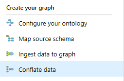
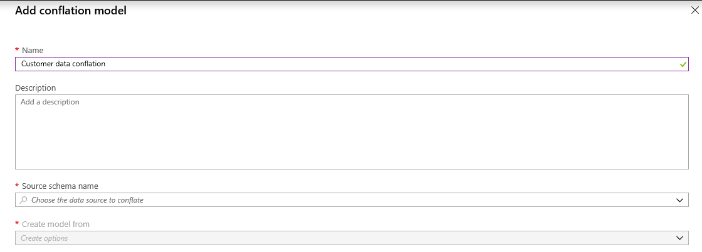
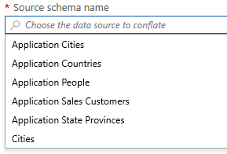
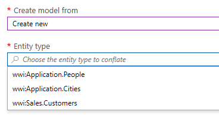
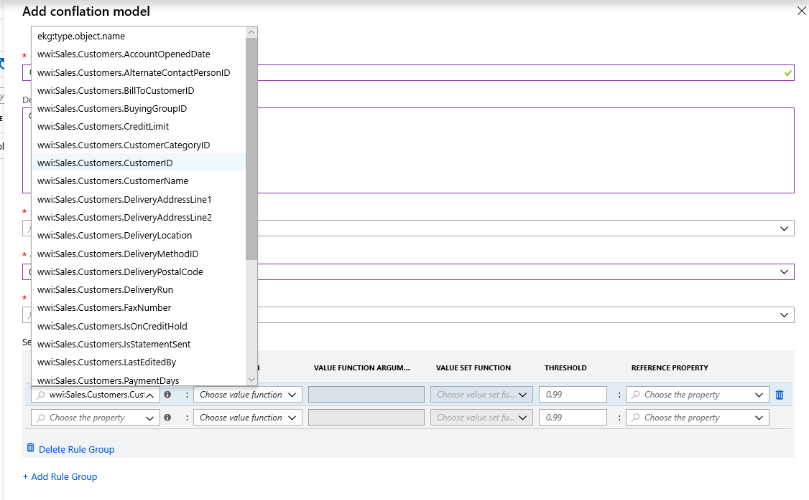

# Conflation in practice

In this example we will create a conflation model to apply to the Customer entity type. 

Previously we have created a source schema to the original Customer data, created a schema map to map that data to the ontology, and then ingested the datat to the graph.

Now, let's assume we want to ingest new data to the graph. To make sure that the new data is ingested correctly, we need to create a conflation model which will match the new data to existing entity instances, or create new entity instances as appropriate.

To begin, navigate to 'Conflate data' on the left side options.



Choose 'Add' to start the process of creating a new model, and you'll see this screen:



The name should be something descriptive, like 'Customer data conflation' in this case, and you can optionally add a more detailed description.

In 'Source schema name', you are choosing the schema map that will be the source of the new data you want to conflate:



In this case, we want to conflate sources for Application Sales Customers, and we choose that option. 

You can then choose to create a new model or import an existing one, if you've already been through this process and understand model creation. For our purposes here, choose to create a new model.

Then you'll see options of which entity type you want to conflate against:



This option enables to choose the type of entity you are updating, i.e. in this case it's ```wwi:Sales.Customers```. 

So to be clear to this point: By choosing your source schema and then choosing the entity type, you are saying 'I want to use the new data from this source to update entity of this type'. Or more specifically in this instance, 'I want to use data from Application Sales Customers to update entities of the type ```wwi:Sales.Customers```.'

Now that we have chosen the new input data and the entity type, we need to set some rules for how the system 'knows' whether this an update to an existing entity instance or a new entity instance, and that's what we do next.


On the left side, we choose the 'Source property', i.e. the property in the source data (via the source schema map) that we want to use for our comparison.



On the right, we choose the property of the existing entities already in the graph that we want to compare against:


Now we need to choose how we want to compare the two values. For a full discussion of this topic, see the conflation rules help document. For now, we're going to use the exact match option:


> [!TIP]
> Note that additional rules inside the same rule group (i.e. within the same shaded grey box) are evaluated as AND rules, and rule groups themselves are evaluated as OR rules. 

Once all of the information is in place, you can create the model. Note that it may take some time to complete, up to several hours depending on the size of your dataset.

When your model is created, the next step is to validate it, and what's what we'll look at next.

