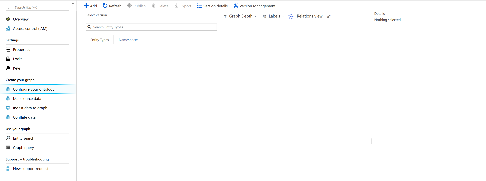

# Ontology in Enterprise Graph

The ontology is the key part of your knowledge graph. It defines the entities, properties, and relationships that you need, to enable the use-cases and analyses that you want.

## Ontology creation in Enterprise Graph

Ontology management and creation tasks are handled from the 'Configure your ontology' section in the tool. 



There are four paths to creating an ontology for your graph:

**(1) Import:** If you have a pre-existing ontology, you can import it here in standard formats OWL or RDF, or you can use the Enterprise Graph JSON format.

**(2) Start with existing:** You can use one of the free pre-supplied ontologies, and modify it if you need to.

**(3) Create from scratch:** Build an ontology for your use cases from scratch.

**(4) Clone existing:** If you have previously created an ontology, you can clone it here to make changes.

## Creating an ontology file

For a sample ontology file to review, see the 01_WWWIOntology.json file in the <a href="https://ekgdemosamples.blob.core.windows.net/ekgdemosamples01/EGDemo_WWI_Files.zip">Enterprise Graph sample files</a>.

Looking through this file content line by line, we see how it opens:

```
{  
      "shorthand":"wwi",
      "namespaceuri":"http://knowledge.microsoft.com/wwi",
      "types":[
...
```

**shorthand** is the short description you want to use for your namespace, in this case 'wwi'

**namespaceuri** is the reference URI for the namespace you are using

**types** is where we get into the bones of the ontology definition, and you describe the properties you want your entities to have

Within **types** we see that the first definition is for the 'Cities' entity type, and it begins:

```
 {  
"namespace":"wwi",
"name":"Application.Cities",
"category":"PRIMARY",
"fields":[  
   {  
      "name":"Location",
      "multiplicity":"Single_valued",
      "type":"String"
   }
```

**namespace**: The namespace this type is to be created in

**name**: The name of the entity type you are creating, in this case Application.Cities. (The word 'Application' comes from the way this example ontology is structure - some entities, like 'cities', are part of the core concepts of the graph 'application', as opposed to something like 'Purchasing.SupplierCategories' which is specific to the purchasing data use-cases.)

**fields**: The properties that this entity will have, that is, links to specific pieces of data or to other entities. The first field that the Application.Cities entity type has is Location, and it's defined like this:

```
{  
  "name":"Location",
  "multiplicity":"Single_valued",
  "type":"String"
}
```

**name** is the name you want to set for the property.

**multiplicity** defines how many values that property may have. A city may have many subareas, for example, but it only has one official population number.

**type** in this case is a string, that is, the type of the data to be entered for the Location property. However note that it is often a link to another entity. For example, in the definition for the StateProvinceID property a bit further down in the Cities definition, we see:

```
{  
  "name":"StateProvinceID",
  "multiplicity":"Single_valued",
  "type":"wwi:Application.StateProvinces"
}
```

In this case, the **type** for the property definition is the entity Application.StateProvinces. This fits with how we naturally think about things - cities are part of a region, and the region itself as a concept has many other values.

> [!tip]
> You cannot make changes to an ontology that is currently live.
