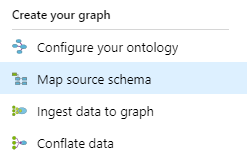
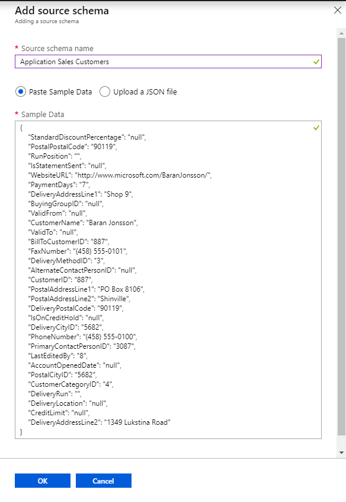

# Creating source schemas

Source schemas are created in the 'Map source schema' section of the interface:

The source schema that you need depends on the source data you use. Input to the graph is in TSV format, and for illustration let's <a href="http://ekgdemosamples.blob.core.windows.net/ekgdemosamples01/12.1_Ingestion_Application.Cities.tsv"> look at the file here.</a>

Use the first line of your input data in JSON format as a sample, which the system will then use to identify your column headers:

Once this is done, you can move on to creating schema maps, completing the link between your source data and your ontology.

> [!IMPORTANT]
> Prior to the final mapping stage being completed, you will see the message 'No fields mapped', i.e. the system is saying that while the soure data is mapped, those fields have not yet been mapped to schema.